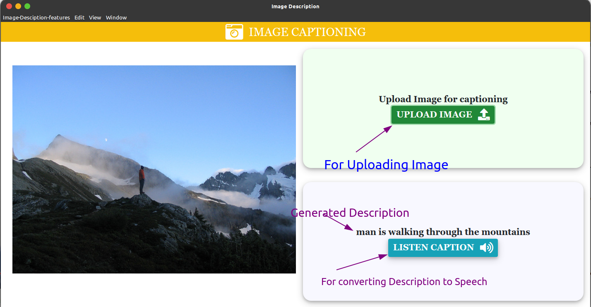

# Desc Mage

#### Image Description GUI

## Table Of Contents

- [Desc Mage](#desc-mage)
      - [Image Description GUI](#image-description-gui)
  - [Table Of Contents](#table-of-contents)
  - [GUI Demo](#gui-demo)
  - [About](#about)
  - [Installation Prerequisites](#installation-prerequisites)
  - [How to Start this Application](#how-to-start-this-application)

## GUI Demo

-   [Click Here to Watch GUI Demo](https://drive.google.com/file/d/1q3kkQavJHsosR-ls6S5eopTvgY9ijHL6/view?usp=sharing)

## About

Eyesight has always been the most important sense for a human being. It provides the ability to see what's in front of us and do the important task of our daily lives without bumping into any object.
Automatically generating captions to an image shows the understanding of the image by computers, which is a fundamental task of intelligence. This will be employed using the RNN model.

A recurrent neural network (RNN) is a class of artificial neural networks where connections between nodes form a directed graph along a temporal sequence. This allows it to exhibit temporal dynamic behavior. Derived from feedforward neural networks, RNNs can use their internal state (memory) to process variable length sequences of inputs. This makes them applicable to tasks such as unsegmented, connected handwriting recognition or speech recognition.

## Installation Prerequisites

-   Nodejs

> To Download Nodejs Package [Go to the Nodejs Download Website](https://nodejs.org/en/download/).

-   Keras

> To Download Keras [Go to Keras Download Website](https://pypi.org/project/Keras/)

-   Tensorflow

> To Download Tensorflow [Go to Tensorflow Installation website](https://www.tensorflow.org/install)

## How to Start this Application

-   **Backend**
    1. Clone this Repo to your Local Machine.
    2. Open The Terminal/CMD in the folder _backend_.
    3. Type `pip install -r requirement.txt` to download all the packages.
    4. Type `export FLASK_APP=app.py` and then `flask run` to run the backend server.

&nbsp;

-   **GUI**
    1. Open The Terminal/CMD in the folder _client_.
    2. Type `npm install` to intall all the libraries.
    3. Type `npm start` to run the application.
    4. Enjoy!! :tada: :sparkles:
